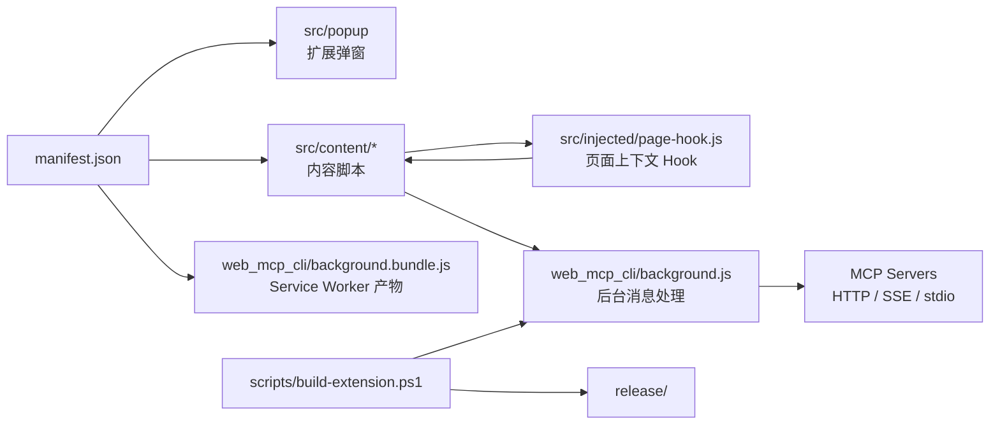

# Cursor Toolbox

> 更新时间：2026-04-08 10:36:05
> 导航：根级

## 项目定位

Cursor Toolbox 是一个基于 Manifest V3 的浏览器扩展，目标是增强 `cursor.com` 网页聊天体验，并把网页聊天、页面注入脚本、扩展后台与 MCP 工具调用串起来。

当前仓库的源码分成 3 条主线：

1. **页面增强链路**：`src/content/*` + `src/injected/page-hook.js`
2. **扩展后台链路**：`web_mcp_cli/background.js`
3. **构建发布链路**：`scripts/build-extension.ps1`

## 快速导航

| 模块 | 作用 | 文档 |
| --- | --- | --- |
| `manifest.json` | 扩展装配入口，定义 popup / content scripts / background | 当前文件 |
| `src/content/` | 内容脚本主协调层，负责状态、布局、会话侧栏、MCP 桥接 | [src/content/CLAUDE.md](src/content/CLAUDE.md) |
| `src/content/bridge-fab/` | FAB、MCP 配置面板、工具执行桥接 | [src/content/bridge-fab/CLAUDE.md](src/content/bridge-fab/CLAUDE.md) |
| `src/content/layout/` | 居中布局、DOM reconcile、消息气泡标记、思考样式 | [src/content/layout/CLAUDE.md](src/content/layout/CLAUDE.md) |
| `src/popup/` | 扩展弹窗与总开关 | [src/popup/CLAUDE.md](src/popup/CLAUDE.md) |
| `src/injected/` | 注入页面上下文的 hook，拦截请求/流式输出/工具协议 | [src/injected/CLAUDE.md](src/injected/CLAUDE.md) |
| `web_mcp_cli/` | Service Worker 源码，负责 MCP 客户端与消息处理 | [web_mcp_cli/CLAUDE.md](web_mcp_cli/CLAUDE.md) |
| `scripts/` | 构建、混淆、产物校验 | [scripts/CLAUDE.md](scripts/CLAUDE.md) |

## 架构总览

## 关键调用链

### 1. 扩展装配
- `manifest.json` 指定：
  - popup：`src/popup/popup.html`
  - background：`web_mcp_cli/background.bundle.js`
  - content scripts：`src/content/*.js` 按清单顺序注入
  - page hook：`src/injected/page-hook.js` 作为 `web_accessible_resources`

### 2. 内容脚本启动
- `src/content/content-core.js`：定义共享常量、`state`、协议前缀、选择器、定时器辅助函数。
- `src/content/content-runtime.js`：真正执行 `init()`，负责：
  - 注入页面 hook
  - 注入样式
  - 恢复本地会话侧栏
  - 从后台同步 MCP 配置
  - 开启 / 关闭插件功能

### 3. 页面脚本桥接
- `src/content/bridge-fab/bridge-core-mcp.js` 通过 `window.postMessage` 把内容脚本状态同步给页面。
- `src/injected/page-hook.js` 在页面上下文中接收这些状态，并向内容脚本回传：
  - `PAGE_HOOK_READY`
  - `PAGE_HOOK_CHAT_REQUEST`
  - `PAGE_HOOK_STREAM_START`
  - `PAGE_HOOK_STREAM_DONE`
  - `PAGE_HOOK_TOOLCODE_FOUND`
  - `PAGE_HOOK_TOOL_FORMAT_RETRY_REQUIRED`
  - `PAGE_HOOK_LOG`

### 4. MCP 调用链
- 内容脚本通过 `chrome.runtime.sendMessage` 请求后台：
  - `MCP_CONFIG_GET`
  - `MCP_CONFIG_SAVE`
  - `MCP_TOOLS_DISCOVER`
  - `MCP_TOOLS_SET_ENABLED`
  - `MCP_TOOLCODE_EXECUTE`
  - `MCP_TOOLCODE_CANCEL`
- `web_mcp_cli/background.js` 使用 `@modelcontextprotocol/sdk` 连接 MCP 服务端，并把结果回传到内容脚本。

### 5. 构建链路
- `scripts/build-extension.ps1`：
  1. 校验 `node` / `pnpm`
  2. 安装 `web_mcp_cli` 依赖
  3. 用 esbuild 打包 `background.js` → `background.bundle.js`
  4. 对 `release/` 下 JS 产物做混淆
  5. 校验 manifest 引用是否完整

## 当前代码组织特点

- **不是模块化打包后的前端工程**：`src/content/*.js` 依赖清单注入顺序与共享全局作用域。
- **协议字符串很多**：`[TM_CONTINUE_*]`、`[TM_TOOL_CALL_*]`、`[MCP_TOOL_RESULT]` 都是跨文件约定，不能只改一处。
- **页面耦合强**：布局和选择器直接依赖 Cursor 网页结构，任何 DOM 改动都可能影响功能。
- **后台产物与源码分离**：应修改 `web_mcp_cli/background.js`，不要直接改 `background.bundle.js`。

## 修改守则

1. **优先改源码，不改产物**
   - 不直接改 `release/`
   - 不直接改 `web_mcp_cli/background.bundle.js`
2. **改协议要全链路追踪**
   - 页面 hook ↔ 内容脚本 ↔ 后台 三端必须同步
3. **改内容脚本要保装载顺序**
   - `manifest.json` 中脚本顺序是运行前提，不要随意交换
4. **改布局先看 reconcile/observer**
   - 很多 UI 不是一次性渲染，而是靠 observer 和定时恢复
5. **仓库当前没有成体系自动化测试**
   - 修改后优先用真实页面场景验证

## 推荐阅读顺序

1. `manifest.json`
2. `src/content/CLAUDE.md`
3. `src/injected/CLAUDE.md`
4. `web_mcp_cli/CLAUDE.md`
5. `scripts/CLAUDE.md`
