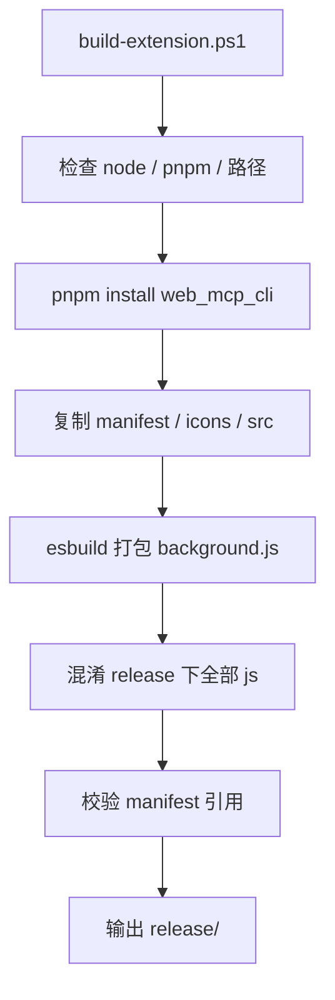

# scripts

> 更新时间：2026-04-08 10:36:05
> 导航：[根级](../CLAUDE.md) / `scripts`

## 模块职责

`scripts/` 负责扩展构建、产物混淆和 manifest 引用校验。

## 文件分工

- `build-extension.ps1`
  - 仓库主构建脚本
  - 安装依赖、打包后台、复制静态资源、混淆 JS、校验 manifest 引用
- `obfuscator.config.json`
  - JavaScript 混淆策略配置

## 构建流程

## 关键规则

1. 产物目录默认是 `release/`。
2. `-SkipInstall` 可跳过依赖安装。
3. 构建后会校验以下 manifest 引用是否真实存在：
   - `background.service_worker`
   - `action.default_popup`
   - `icons.*`
   - `content_scripts[*].js/css`
   - `web_accessible_resources[*].resources`
4. 混淆只针对输出目录，不直接改源码。

## 修改守则

1. 修改 manifest 路径时，务必同步校验逻辑预期。
2. 新增源码入口后，要确认是否被复制到 `release/`。
3. 新增后台依赖后，要确认 esbuild bundling 是否仍可正常输出。
4. 不要把构建产物路径写死到与 manifest 不一致。
