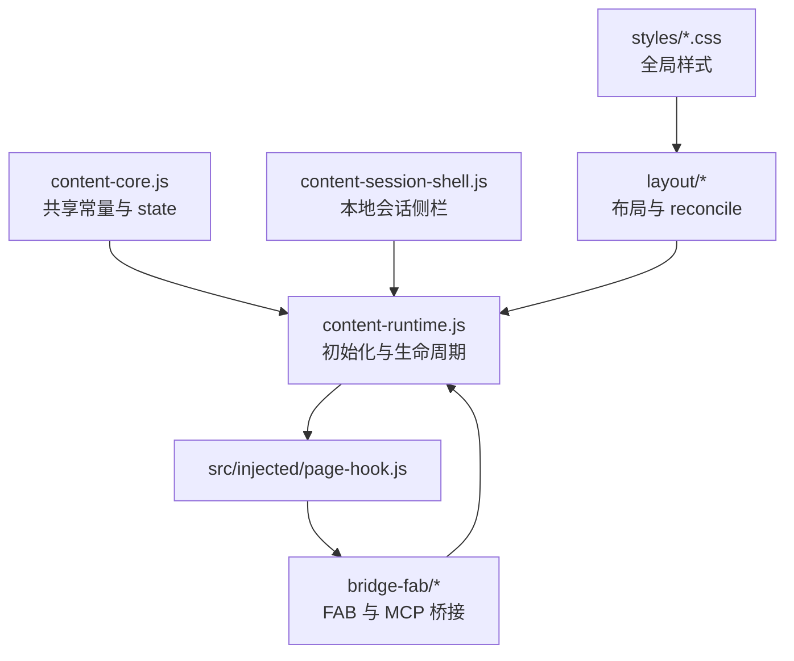

# src/content

> 更新时间：2026-04-08 10:36:05
> 导航：[根级](../../CLAUDE.md) / `src` / `content`

## 模块职责

`src/content/` 是扩展的主协调层，负责把“页面增强、会话侧栏、MCP 工具桥接、布局修复、样式注入”串成一个整体。

这里最大的特点是：**所有内容脚本共享同一个页面上下文与全局作用域**，因此文件加载顺序本身就是架构的一部分。

## 装载顺序（非常重要）

`manifest.json` 当前按如下顺序注入：

1. `content-core.js`
2. `content-session-shell.js`
3. `bridge-fab/bridge-core-mcp.js`
4. `bridge-fab/bridge-mcp-runner.js`
5. `bridge-fab/bridge-fab-recovery-layout.js`
6. `bridge-fab/bridge-mcp-panel.js`
7. `bridge-fab/bridge-ui-guards.js`
8. `layout/layout-core.js`
9. `layout/layout-reconcile-observer.js`
10. `layout/layout-thinking-style.js`
11. `content-runtime.js`

`content-runtime.js` 最后注入，是因为它会调用前面文件里已经挂到全局作用域上的函数。

## 目录结构

## 文件分工

### 核心层
- `content-core.js`
  - 共享选择器、协议前缀、存储 key、默认策略
  - 全局 `state` 的唯一源头
  - 定时器、路由 key、文本清洗等基础函数
- `content-runtime.js`
  - `init()` / `enablePluginFeatures()` / `disablePluginFeatures()`
  - 注入 page hook 与 thinking 样式
  - 绑定页面事件、窗口事件、`chrome.runtime.onMessage`
  - 启动 DOM observer、reconcile、startup recovery

### 会话侧栏
- `content-session-shell.js`
  - 本地会话历史存储与恢复
  - 历史记录 HTML 清洗
  - 思考块 / 工具调用块在历史中的渲染
  - 与 IndexedDB / `chrome.storage.local` 相关的会话持久化逻辑

### 子模块
- `bridge-fab/*`：见 [bridge-fab/CLAUDE.md](bridge-fab/CLAUDE.md)
- `layout/*`：见 [layout/CLAUDE.md](layout/CLAUDE.md)
- `styles/*.css`：提供全局基础视觉、会话侧栏样式、响应式适配

## 运行主线

1. `content-runtime.js` 调用 `init()`
2. 注入 `src/injected/page-hook.js`
3. 注入思考样式、恢复本地会话、拉取 MCP 配置
4. 根据 `enabled` 状态启动或关闭：
   - DOM observer
   - 自动展开
   - 布局 reconcile
   - 会话同步
   - 启动恢复逻辑
5. 页面 hook 回传流式/工具事件后，`bridge-mcp-runner.js` 继续处理工具执行与回填

## 关键共享状态

`content-core.js` 里的 `state` 被多个文件共同读写，重点包括：

- `streamContinuation`：截断续写状态
- `sessions*`：本地会话、分页、持久化状态
- `mcp*`：MCP 配置、工具执行、自动轮次、取消状态
- `shell*`：侧栏与布局状态
- `domObserver*` / `*Timer`：reconcile 与恢复相关定时器

**结论：**改 `state` 字段名、默认值或语义时，必须全目录追踪引用。

## 变更注意事项

1. **不要把这里当 ES Module 改**
   - 文件之间大量靠全局函数与常量协作
   - 新增函数要考虑命名冲突

2. **协议改动必须联动页面 hook**
   - `CONTENT_SET_*`
   - `PAGE_HOOK_*`
   - `[TM_CONTINUE_*]`
   - `[TM_TOOL_CALL_*]`
   - `[MCP_TOOL_RESULT]`

3. **会话功能改动要联动三处**
   - `content-session-shell.js`
   - `layout/layout-reconcile-observer.js`
   - `bridge-fab/bridge-mcp-runner.js`

4. **布局问题优先看 observer / reconcile / recovery**
   - 很多 UI 被“拉回正确状态”的逻辑不止一层
   - 只改 CSS 往往不够

5. **新增设置项时要确认同步路径**
   - popup 是否需要入口
   - content 是否需要存储 key
   - page hook 是否需要同步到页面上下文
   - background 是否需要读取

## 高风险耦合点

- `content-runtime.js` 的初始化与开关生命周期
- `content-core.js` 的协议常量
- `content-session-shell.js` 的历史清洗与持久化格式
- `bridge-mcp-runner.js` 的工具执行闭环
- `layout/layout-reconcile-observer.js` 的 DOM 选择器与标记类名
