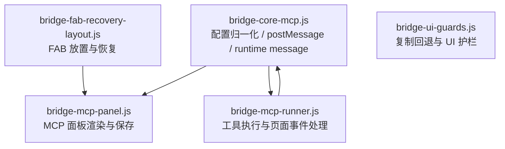

# src/content/bridge-fab

> 更新时间：2026-04-08 10:36:05
> 导航：[根级](../../../CLAUDE.md) / [src/content](../CLAUDE.md) / `bridge-fab`

## 模块职责

`bridge-fab/` 负责内容脚本里的“交互桥接层”：

- 输入区旁边的 FAB 与附属 UI
- MCP 配置面板
- 页面 hook ↔ 内容脚本 的消息处理
- 工具代码执行、取消、重试、续写
- 一些补丁型 UI guard（复制按钮回退、隐藏干扰按钮等）

## 文件分工

### `bridge-core-mcp.js`
- MCP server 配置、tool policy、transport 的归一化
- `postToPage()`：向页面上下文发 `CONTENT_SET_*` 与 `CONTENT_SYNC_MCP_STATE`
- `sendRuntimeMessage()`：发给后台 Service Worker
- `refreshMcpConfigFromBackground()`：把后台配置拉回内容脚本状态

### `bridge-mcp-panel.js`
- MCP 配置面板渲染、开关、定位、关闭
- 解析 JSON 配置与工具策略输入
- 配置保存、工具发现、启用状态切换
- 面板状态与 `state.mcpPanelOpen` / `state.mcpDiscoveredToolsByServer` 联动

### `bridge-mcp-runner.js`
- 接收 `page-hook.js` 回传的 `PAGE_HOOK_*` 事件
- 识别工具代码块、发起工具执行
- 处理取消、格式重试、自动轮次、截断续写
- 把工具结果自动回填到页面对话流

### `bridge-fab-recovery-layout.js`
- 创建 FAB host
- 输入区旁按钮放置与恢复
- 全局提示词入口、MCP 配置入口
- 一些压缩总结/续写相关快捷交互依赖这里挂载

### `bridge-ui-guards.js`
- 代码复制按钮回退
- Tokenizer 按钮抑制
- 隐藏干扰 UI
- 属于“保护层”，不是业务主线，但会影响实际体验

## 关键消息协议

### 内容脚本 → 页面上下文
- `CONTENT_SET_ENABLED`
- `CONTENT_SET_THINKING_INJECTION`
- `CONTENT_SET_GLOBAL_PROMPT_INSTRUCTION`
- `CONTENT_SYNC_MCP_STATE`
- `CONTENT_AUTO_SEND_TOOL_RESULT`

### 页面上下文 → 内容脚本
- `PAGE_HOOK_READY`
- `PAGE_HOOK_CHAT_REQUEST`
- `PAGE_HOOK_STREAM_START`
- `PAGE_HOOK_STREAM_DONE`
- `PAGE_HOOK_TOOLCODE_FOUND`
- `PAGE_HOOK_TOOL_FORMAT_RETRY_REQUIRED`
- `PAGE_HOOK_LOG`

### 内容脚本 → 后台
- `MCP_CONFIG_GET`
- `MCP_CONFIG_SAVE`
- `MCP_TOOLS_DISCOVER`
- `MCP_TOOLS_SET_ENABLED`
- `MCP_TOOLCODE_EXECUTE`
- `MCP_TOOLCODE_CANCEL`

## 修改守则

1. **协议名不要单点修改**
   - 这里一旦改动，至少要同步：
     - `src/injected/page-hook.js`
     - `web_mcp_cli/background.js`
     - `src/content/content-core.js`

2. **工具执行链不要只看 happy path**
   - 还要检查：
     - 取消路径
     - 重试路径
     - 自动轮次上限
     - 截断续写路径

3. **面板表单改动要保证归一化一致**
   - `bridge-core-mcp.js` 与 `web_mcp_cli/background.js` 都有 transport / policy normalize 逻辑
   - 字段语义必须一致

4. **FAB 放置改动要考虑不同布局状态**
   - inline / drawer 两种放置方式都要兼容
   - 和 `layout/` 的居中布局联动非常强

## 高风险耦合点

- `onPageMessage()` 的事件路由
- `CONTENT_AUTO_SEND_TOOL_RESULT` 的自动回填
- 工具调用协议标记：`[TM_TOOL_CALL_START:*]` / `[TM_TOOL_CALL_END:*]`
- 续写协议标记：`[TM_CONTINUE_*]`
- `state.mcp*` 相关字段的生命周期管理
