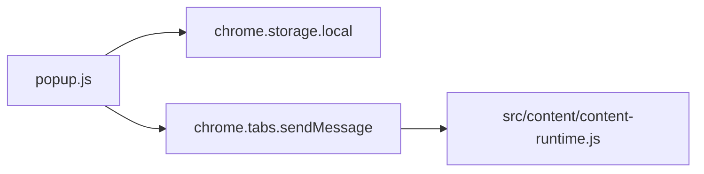

# src/popup

> 更新时间：2026-04-08 10:36:05
> 导航：[根级](../../CLAUDE.md) / `src` / `popup`

## 模块职责

`src/popup/` 是扩展图标弹出的最小控制面板，当前职责很单一：**控制插件总开关**。

## 文件分工

- `popup.html`
  - 定义弹窗结构与内联样式
  - 提供总开关、状态指示器、底部说明
- `popup.js`
  - 启动时从 `chrome.storage.local` 读取 `enabled`
  - 用户切换开关后：
    1. 更新弹窗 UI
    2. 持久化 `enabled`
    3. 通知当前活动标签页内容脚本执行 `togglePlugin`

## 调用链

## 注意事项

1. popup 只影响“总开关”，不直接处理 MCP 细节。
2. 若页面未注入内容脚本，`chrome.runtime.lastError` 会被静默忽略，这是预期行为。
3. 如果未来新增 popup 设置项，要同步确认：
   - 是否需要 `chrome.storage.local`
   - 是否需要内容脚本即时生效
   - 是否需要页面 hook 或后台参与
