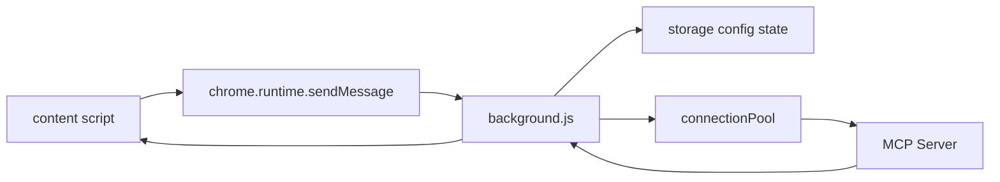

# web_mcp_cli

> 更新时间：2026-04-08 10:36:05
> 导航：[根级](../CLAUDE.md) / `web_mcp_cli`

## 模块职责

`web_mcp_cli/` 保存扩展后台 Service Worker 的源码与依赖。实际加载的是打包产物 `background.bundle.js`，但**开发时应修改 `background.js`**。

它负责：

- 维护 MCP 配置与启用工具状态
- 连接 MCP 服务端（streamable-http / SSE / stdio）
- 执行工具调用与取消
- 管理连接池与空闲清理
- 响应内容脚本发来的 runtime message

## 依赖

- `@modelcontextprotocol/sdk`
- 构建：`esbuild`
- 混淆：`javascript-obfuscator`

## 关键消息入口

`background.js` 当前支持：

- `MCP_CONFIG_GET`
- `MCP_CONFIG_SAVE`
- `MCP_TOOLS_DISCOVER`
- `MCP_TOOLS_SET_ENABLED`
- `MCP_TOOLCODE_EXECUTE`
- `MCP_TOOLCODE_CANCEL`
- `TAB_FORCE_RELOAD`
- 兼容入口：`action === "test_mcp"`

## 处理流程

## 内部职责分层

### 配置层
- 归一化 server 配置、headers、env、args、tool policy
- 合并 `enabledToolsByServer` 与 `discoveredToolsByServer`
- 持久化 `chrome.storage.local`

### 连接层
- 基于 server 配置建立 MCP client / transport
- 支持：
  - `streamable-http`
  - `sse`
  - `stdio`
- 使用 `connectionPool` 做复用与 TTL 清理

### 执行层
- `listTools()` 做工具发现
- `callTool()` 做工具执行
- 支持取消、重试与结果截断

## 修改守则

1. **只改 `background.js`，不要直接改 bundle。**
2. **前后端归一化逻辑要一致。**
   - `bridge-core-mcp.js` 里也有 transport / policy normalize。
3. **新增消息类型时，要同步内容脚本发起端。**
4. **连接池和取消逻辑不要轻易删。**
   - 这些决定了长连接、多工具调用和页面交互体验。

## 构建说明

仓库通过 `scripts/build-extension.ps1` 执行：
- `pnpm --dir web_mcp_cli install --frozen-lockfile`
- `pnpm --dir web_mcp_cli exec esbuild background.js ... --outfile=background.bundle.js`

最终 bundle 会被复制到 `release/web_mcp_cli/background.bundle.js` 并进一步混淆。
